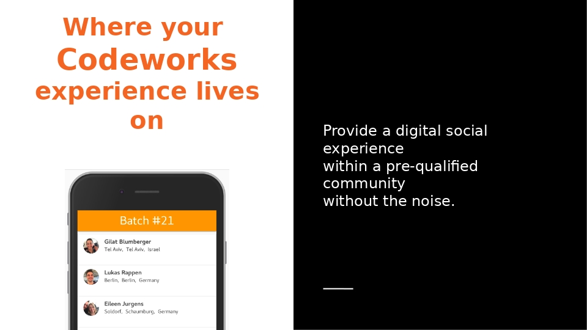

# Week13 Server API

The Official Codeworks Alumni Newtork

## Ask the community
Get career & tech advice

Network with qualified peers

Find project collaborators

### Screenshots

### API Installation
To run the app please follow these instructions:

* Download or Clone this repo
* Run npm install in the project folder
* In order to start up the db: 
   * Install Docker
   * Download the PostgreSQL container
   * Run docker-compose up --build in your project folder
   * Start the server "npm start" 

### Tech Stack
* Koa
* PostgreSQL
* Sequelize
* Docker

### Developer
Cesar Valdez Cervera [LinkedIn](https://www.linkedin.com/in/cesar-valdez-cervera/)
